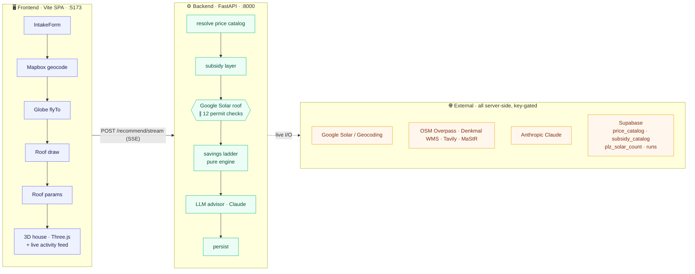
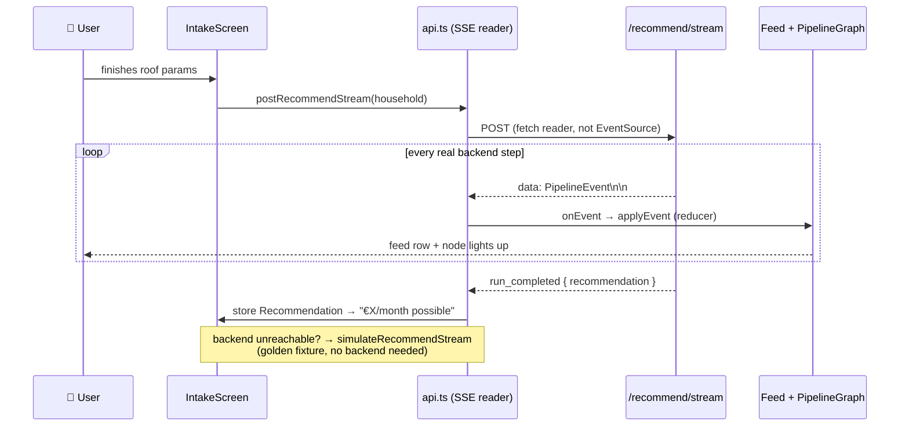
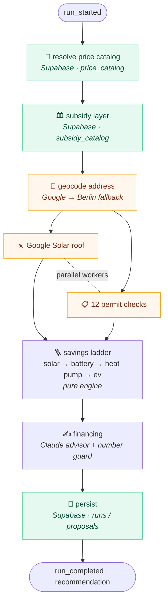

<div align="center">

# 🏡⚡ Heimwende Energy Advisor

### One number. _How much your household saves per month_ after going all-electric.

Solar · Battery · Heat&nbsp;Pump · EV&nbsp;Charger — bundled with financing and a dynamic tariff, sold as **a single product**.

<br/>


<br/>


</div>

---

This README is the **workflow map** — it walks the system end-to-end: from the first keystroke in the
address box, through the Mapbox globe and the 3D house, into each backend layer (what it crawls, what
it reads from Supabase), and back out over a **live event stream** that shows the user what the
backend is doing in real time.

> [!NOTE]
> For the deep design rationale (every formula + source) see [`docs/design_plan/system_workflow.md`](docs/design_plan/system_workflow.md).
> For the live-stream contract see [`apps/frontend/data/connection.md`](apps/frontend/data/connection.md).
> `specs/` is the **frozen source of truth** and wins over prose when they disagree.

---

## 🗺️ The 10,000-ft view



Two apps, two toolchains:

| App | Stack | Dev command | Port |
|---|---|---|:---:|
| 🖥️ [`apps/frontend`](apps/frontend) | Vite + React + TS + Tailwind · TanStack Query · Mapbox GL · Three.js / react-three-fiber | `pnpm dev` | `5173` |
| ⚙️ [`apps/backend`](apps/backend) | FastAPI (Python 3.12, **uv**) — BFF **and** pure domain core | `uv run uvicorn app.main:app --app-dir src --reload --port 8000` | `8000` |

> [!IMPORTANT]
> **Cross-cutting rules** — the LLM **never computes the number** (all money math is deterministic
> domain code) · **no secrets in the frontend bundle** (only `VITE_API_BASE_URL` + `VITE_MAPBOX_TOKEN`) ·
> the domain core never imports adapters · every external call is server-side · **every layer is
> offline-safe** — a failed source degrades to a labelled fallback, it never kills the run.

---

## 1️⃣ Frontend Act 1 — inputs → Mapbox → 3D house

The whole intake is a **5-step state machine** in
[`IntakeScreen.tsx`](apps/frontend/src/features/intake/IntakeScreen.tsx) over **one shared Mapbox
map** and a Three.js stage:

```mermaid
stateDiagram-v2
    direction LR
    [*] --> intake
    intake --> zooming: address picked → flyTo
    zooming --> roof_draw: globe settles (moveend)
    roof_draw --> roof_params: polygon drawn / skipped
    roof_params --> viewing: runRecommend()
    viewing --> [*]: View offers

    intake: 📝 intake · IntakeForm
    zooming: 🌍 zooming · globe flyTo
    roof_draw: ✏️ roof-draw · trace roof
    roof_params: 📐 roof-params · type + pitch
    viewing: 🏠 viewing · 3D model + live feed
```



<details>
<summary><b>2.1 — Address input → Mapbox geocoding</b></summary>

<br/>

[`IntakeForm.tsx`](apps/frontend/src/features/intake/IntakeForm.tsx) collects the `Household`
(React Hook Form + Zod via a hand-rolled `zodResolver`). Mandatory fields: **street + house number**,
postcode (PLZ), city, floor area, building year, occupants, electricity €/mo, heating
`{fuel, eur_month}`, mobility `{kind, km_month}`.

Two ways to fill it:

1. **Address autocomplete** — a debounced call to [`mapbox-geocode.ts`](apps/frontend/src/lib/mapbox-geocode.ts)
   hits Mapbox forward geocoding (`api.mapbox.com/geocoding/v5/mapbox.places`, restricted `country=de`,
   `autocomplete=true`, using `VITE_MAPBOX_TOKEN`). Picking a suggestion fills street/house_no/plz/city
   **and** fires `onAddressPick(lat, lon)`.
2. **Demo bill upload** — `extractDemoDocument()` inspects an uploaded file name and pre-fills intake
   fields (electricity / gas / heating bill → address + spend + fuel type). A demo extraction stub, no real OCR.

</details>

<details>
<summary><b>2.2 — The Mapbox globe (flyTo zoom)</b></summary>

<br/>

[`globe-background.tsx`](apps/frontend/src/components/globe-background.tsx) renders a full-screen
Mapbox map: `mapbox://styles/mapbox/satellite-streets-v12`, `projection: "globe"`, starting zoomed
out (`zoom 1.75`) and **slowly spinning** via a `moveend` step loop.

- `onAddressPick` → `globeRef.flyTo(lat, lon)` → `zoomTo()` drops a marker and `map.flyTo({ zoom: 19 })`,
  diving from the globe to the rooftop → step `zooming`.
- When the flight settles (`map.once("moveend")`), `onZoomComplete` fires → `IntakeScreen` grabs the
  **same map instance** (`getMap()`) and advances to `roof-draw`. The map is reused, not recreated, so
  the satellite imagery stays warm.

> [!TIP]
> `React.StrictMode` is intentionally omitted in `main.tsx` — its dev double-mount churns Mapbox GL's WebGL context.

</details>

<details>
<summary><b>2.3 — Roof draw + parameters</b></summary>

<br/>

- [`RoofDrawStep`](apps/frontend/src/features/roof/RoofDrawStep.tsx) + [`useMapboxDraw.ts`](apps/frontend/src/features/roof/useMapboxDraw.ts)
  overlay `@mapbox/mapbox-gl-draw` on the zoomed satellite view. The user traces the roof outline; the
  hook returns the polygon ring as `LatLng[]` (`@turf/turf` for geometry). The step can be **skipped** → a default footprint is used.
- [`RoofParamsStep`](apps/frontend/src/features/roof/RoofParamsStep.tsx) collects roof **type**
  (flat / gable / hip / shed), **pitch°**, and wall height.

Hitting "next" on params calls `runRecommend()` (→ Act 2) and switches to `viewing`.

</details>

---

## 2️⃣ Resizing the panel & the 3D components

Two distinct "resizing" behaviours — the **layout panels** and the **3D geometry** — both driven by
the drawn polygon and viewport.

### 🪟 The layout: sliding panel → split stage

CSS in [`index.css`](apps/frontend/src/index.css) (`@layer components`):

| Phase | Behaviour |
|---|---|
| `intake` | Flex row: spinning globe fills the left; white `.intake-form-col` is a fixed right panel — **`--form-col-w: min(480px, 38vw)`** (resizes with the viewport). |
| confirm | `formHidden` adds `.intake-form-col--revealed` → `transform: translateX(100%)` **slides the panel off-screen** (400 ms eased), giving the globe/house full width. |
| `viewing` | `.viewer-split` flex row below the 52 px StepBar: `.viewer-stage` (`flex: 3 1 0`) absorbs the slack and the R3F `<Canvas>` auto-resizes to fill it; `.viewer-feed` (`flex: 0 0 clamp(300px, 27vw, 380px)`) clamps so the feed stays readable. |

Stage overlays (`.viewer-stage-header`, `.viewer-tier-bar`, `.viewer-status-pill`) are absolutely
positioned and `pointer-events`-gated so empty gaps don't steal OrbitControls drags.

### 🧊 The 3D model: geometry that scales with the roof

[`roofGeometry.ts`](apps/frontend/src/features/viewer/roofGeometry.ts) is a **pure module** (no React,
no DOM) turning `(LatLng[] | null, RoofParams)` into Three.js `BufferGeometry[]`:

1. **Footprint** — `latLngToLocal()` converts the drawn polygon to local metre space via turf rhumb
   bearing/distance (preserving real-world azimuth, so panels face the right way); `orientedFootprint()`
   fits an oriented bounding rectangle whose long axis becomes the ridge. No polygon → default 10×8 m.
2. **Roof builders** — `buildFlatRoof` / `buildGableRoof` / `buildHipRoof` / `buildShedRoof` extrude
   walls + roof planes and emit `RoofPlacementSurface[]` (orientation/area) for PV placement.
3. **Module slots** — `moduleSlots()` anchors the four props (☀️ PV · 🔋 battery · ♨️ heat pump · 🚗 EV)
   to the footprint axes, so they **stay glued to the right wall/corner and scale with the house** even
   when it's rotated to its true bearing.

[`HouseCanvas.tsx`](apps/frontend/src/features/viewer/HouseCanvas.tsx) (react-three-fiber) renders it:
camera framing scales off the footprint half-extents (`reach`) so big & small houses both frame cleanly;
`dpr={[1, 2]}` for retina; `OrbitControls` clamp zoom + tilt; an **extrude-up** animation lerps the
group 0→1 (~1 s). `addons: Record<ModuleKind, boolean>` decides which props mount — driven by the
selected **tier** (low / mid / high) via `.viewer-tier-bar`; each tier maps to a rung of the savings ladder.

---

## 3️⃣ Frontend Act 2 — the live connection (real-time stream)

On reaching `viewing`, `IntakeScreen.runRecommend()` opens a **streaming** call rather than a one-shot
request. This is the product's signature: the user watches the backend actually work, not a spinner.



<details>
<summary><b>Transport, event model & reducer</b></summary>

<br/>

The tablet/feed is not a decorative "loading" component. It is the frontend surface for the backend
pipeline. The goal is that a user, judge, or partner can see the platform doing real work: resolving
catalog data, calling Google, checking public internet sources, applying deterministic rules, handling
fallbacks, and finally producing the financed recommendation.

**Transport** — [`postRecommendStream()`](apps/frontend/src/lib/api.ts) does `POST
/api/v1/advisor/recommend/stream`, reads the body as a stream, splits SSE frames on blank lines
(`\n\n`), parses each `data:` line into a `PipelineEvent`. It's a POST body → a `fetch` reader, **not** `EventSource`.

**Offline-safe** — if the backend is unreachable it falls back to `simulateRecommendStream(...)`, a
scripted-but-realistic sequence whose numbers come from a golden `Recommendation`, so the live UI works
with **no backend running**.

**Why the stream matters** — the backend has several slow or failure-prone steps: Supabase reads,
Google Geocoding, Google Solar, Overpass, Denkmal WMS, Tavily, Claude, and persistence. A one-shot
request would hide that complexity behind a spinner. The SSE stream exposes each step as it happens,
including fallbacks, so the demo can prove that the platform is not inventing a final number in one
opaque model call.

**Event model & reducer** — [`pipeline.ts`](apps/frontend/src/features/activity/pipeline.ts) mirrors
the backend wire contract ([`api/schemas/pipeline.py`](apps/backend/src/app/api/schemas/pipeline.py)).
Each `PipelineEvent` has `layerId · type · status · title · source · payload`. Layers:
`parent · solar · battery · heat_pump · ev_charger · subsidy · permit · financing`.
`applyEvent()` is a **pure reducer** folding events into `PipelineRunState`. Two surfaces consume it:

- [`PipelineGraph`](apps/frontend/src/features/activity/PipelineGraph.tsx) — live node graph ("N checks running in parallel").
- [`ActivityFeed`](apps/frontend/src/features/activity/ActivityFeed.tsx) — text timeline tagged by source (`Google Solar`, `Supabase`, `Engine`, `LLM`…).

The terminal `run_completed` event carries the full `Recommendation` in `payload.recommendation` →
status pill flips to **"€X/month possible"**, and "View offers" opens
[`OfferResultPage`](apps/frontend/src/features/offer/OfferResultPage.tsx) (the three-tier dashboard).

**What the user sees in the tablet/feed**

- `step_started` / `step_completed` events show blocking parent work such as price-catalog resolution
  and geocoding.
- `worker_started` / `worker_completed` events show parallel workers, especially Google Solar and the
  permit checks.
- `layer_completed` events mark business milestones: subsidy applied, permits complete, financing ready.
- `fallback_used` events are first-class output, not hidden logs. If an API key is missing or an internet
  source fails, the UI can still explain which conservative fallback was used.
- The reducer keeps the feed and graph deterministic: UI state is derived from events, not from timers.

</details>

---

## 4️⃣ Backend pipeline — what each layer does (crawling + Supabase)

[`run_stream.stream_recommendation()`](apps/backend/src/app/services/run_stream.py) runs the **same**
pipeline as the non-streaming `/recommend`, but as an async generator yielding SSE frames. Blocking I/O
is offloaded to a thread executor so the stream stays responsive; an optional `demo_pacing_ms` throttle
makes each step legible (off = real speed).

The important architecture point: the backend is both a BFF for the pnpm/Vite frontend and the trusted
domain runtime. The frontend sends a household payload and renders events; the backend owns every secret,
every external API call, every Supabase read/write, and all money/physics logic. That keeps the browser
lightweight and makes the platform demo credible: the final number comes from deterministic backend
layers, not from frontend mock state or LLM copy.



<details open>
<summary><b>4.1 — Resolve price catalog · Supabase <code>price_catalog</code></b></summary>

<br/>

[`Resolver`](apps/backend/src/app/adapters/resolver.py) reads the **`price_catalog`** table for the PLZ
(PV €/kWp, battery €/kWh, heat-pump/wallbox fixed, fuel prices, retail/feed-in €/kWh, public-charge
price) plus per-PLZ grid-fee overlays, and builds a `PricingContext`. **Prices are never hard-coded** —
the pure engine receives them injected. Offline → seeded constants.

This is the first guard against "demo math." The engine does not own market prices. It receives an
input context assembled from Supabase, so the same household can produce different economics when local
tariffs, fuel prices, grid overlays, or installation costs change. In demo mode the seeded constants
keep the flow alive, but the production shape is data-driven:

- Supabase is the source for catalog values and PLZ-specific overlays.
- `Resolver.resolve_pricing(plz)` translates database rows into the typed `PricingContext` expected by
  the pure engine.
- The downstream engine can be tested with fixed contexts because it does not call Supabase itself.
- If Supabase is unavailable, the event stream can still complete with a labelled fallback instead of
  failing the customer journey.

</details>

<details>
<summary><b>4.2 — Subsidy layer · Supabase <code>subsidy_catalog</code></b></summary>

<br/>

[`subsidy_layer/catalog.py`](apps/backend/src/app/domain/savings/subsidy_layer/catalog.py)
`resolve_subsidies()` queries the **`subsidy_catalog`** table (PostgREST), filters rows **eligible on
the request date** (`valid_from ≤ today ≤ valid_until`), groups them into a `SubsidyContext`:

- KfW 458 base (30 %) + Klima-Geschwindigkeitsbonus (20 %, fossil→HP only), capped at the **70 % KfW
  hard cap**; 0 % VAT on PV/battery (§12(3) UStG); BAFA EV Umweltbonus (ended 2023 → 0 %).
- Each row carries a `source_url` + validity window so the engine can **cite** the subsidy.
- Gating is **data, not logic** — expired programmes drop out automatically.
- Offline-safe: with no Supabase it returns the same six MVP rows the seed migration writes.

[`crawler.py`](apps/backend/src/app/domain/savings/subsidy_layer/crawler.py) is the periodic-refresh stub (stretch).

This layer is intentionally separate from the savings math. The catalog answers "which programmes are
currently eligible and what are their caps?" The engine answers "how do those programmes affect this
household's financed offer?" That separation matters because subsidy rules change often; the platform
can refresh rows and validity windows without rewriting the economic model.

</details>

<details>
<summary><b>4.3 — Site analysis · Google Solar ∥ 12 permit checks (the crawling layer)</b></summary>

<br/>

`_site_analysis_events()` first **geocodes** the address (Google Geocoding, Berlin-centre fallback),
then launches the following as **concurrent workers** (`asyncio` + thread executor + a result queue),
each emitting its own worker lane in the feed.

**☀️ Google Solar roof** — [`solar_layer/google_solar.py`](apps/backend/src/app/domain/savings/solar_layer/google_solar.py)
calls `buildingInsights:findClosest` → max panels, dominant orientation, usable area, and
**site-specific PV yield** (kWh/kWp). No coverage / no key → fallback yield. The fuller sizing/physics/
3-offer engine lives in [`solar_layer/pipeline.py`](apps/backend/src/app/domain/savings/solar_layer/pipeline.py)
(backtested against 1,062 real DE projects).

The Google Solar integration is one of the science-heavy parts of the platform:

1. The backend builds a real address string from the intake payload and sends it to Google Geocoding.
   The resulting latitude/longitude becomes the shared coordinate input for both roof analysis and
   location-based permit checks.
2. Google Solar `buildingInsights:findClosest` returns building-level solar potential around that
   coordinate. The backend does not just store the raw response; it parses it into `RoofData`.
3. `parse_roof()` reads `solarPotential.roofSegmentStats`, sums viable south-facing roof segments
   (azimuth 90-270 degrees), and excludes north-facing surfaces where possible because they are usually
   not commercially attractive for PV.
4. The usable roof area is converted into a maximum panel count using the active panel footprint. The
   default footprint is based on a real 440 W class panel size.
5. Dominant orientation is derived from the largest viable roof segment. That orientation informs the
   PV offer and gives the user a credible explanation for the recommendation.
6. Site-specific yield is derived from Google's `solarPanelConfigs`: the backend chooses the closest
   panel-count configuration and divides yearly DC output by installed kWp. That produces
   `specific_yield_kwh_per_kwp`, which is materially better than a static Germany average when Google
   coverage exists.
7. That yield is injected into the deterministic savings engine. The later solar, battery, heat-pump,
   and EV calculations therefore inherit the roof-specific production estimate.

The physics/economics pipeline then turns those roof facts into offer math:

- [`solar_layer/pipeline.py`](apps/backend/src/app/domain/savings/solar_layer/pipeline.py) carries the
  panel catalog: watt-peak, dimensions, efficiency, weight, and panel cost.
- Commercial assumptions such as €/kWp, battery €/kWh, wallbox cost, tariffs, feed-in rates, and panel
  selection are overridable through config.
- Physics assumptions are locked: self-consumption curves, battery uplift, discount rate, orientation
  factors, and boiler efficiency are not casually overridden by the UI.
- `simulate_energy()` and `simulate_economics()` convert PV size, household demand, battery size, and
  tariffs into production, self-consumption, export, savings, payback, and offer economics.
- Fallback is explicit: if Google Solar has no coverage or an API key is missing, the platform uses a
  conservative `950 kWh/kWp/year` German-average yield and emits a `fallback_used` event.

That means the demo can honestly say: the solar offer is based on roof geometry, panel dimensions,
orientation, irradiance/yield assumptions, self-consumption physics, battery behaviour, and household
demand — not a generic "solar savings" prompt.

**📋 12 permit checks** — [`permit_layer/checks.py`](apps/backend/src/app/domain/savings/permit_layer/checks.py),
one function per check, each making live HTTP calls and returning a `PermitCheck` (pass / warn / fail /
info, with cited clause + source URL):

| Check | What it crawls / its source |
|---|---|
| PLZ → Bundesland | **OpenPLZ API** (`openplzapi.org`) |
| Solar — Denkmalschutz | **Denkmal WMS** `GetFeatureInfo` per Bundesland (Bayern, NRW, Berlin, RLP…) → **OSM Overpass** `historic/heritage` fallback |
| Heat pump — Denkmalschutz | same sources, warn (not auto-fail) |
| Solar **+** HP — Bebauungsplan | **Tavily** web search → **Claude Haiku** extracts permit clauses as JSON (RAG) |
| Solar — neighbour precedent | **MaStR count**: Supabase `plz_solar_count` → scrape MaStR page → **Tavily** → warn (tiered) |
| EV — private parking | **OSM Overpass** (`amenity=parking`) + user checkbox |
| EV — apartment / WEG | **OSM Overpass** building type → §20 WEG / §554 BGB |
| HP — GEG 2024 boiler age | hardcoded rule (GEG §71/§72) from building year + fuel |
| HP — TA Lärm noise | **OSM Overpass** plot density (≤45 dB night advisory) |
| Solar — LBO verfahrensfrei | hardcoded LBO baseline |
| Battery — install + MaStR | hardcoded advisories |

Every check is wrapped so a network failure degrades to a `warn` event rather than killing the run. The
heavier batch path (with a Supabase result cache) is [`permit_layer/engine.py`](apps/backend/src/app/domain/savings/permit_layer/engine.py);
also exposed standalone at `POST/GET /api/v1/advisor/permits[/stream]`.

The permit layer is the other major crawling layer. Its job is not to make a final legal decision; its
job is to turn public internet and registry evidence into structured risk signals before a proposal is
shown. The flow is:

1. `plz_to_bundesland()` calls OpenPLZ and maps the postal code to a Bundesland. This decides which
   state-level Denkmal source should be used.
2. Denkmal checks query official WMS `GetFeatureInfo` endpoints where a Bundesland exposes one. Where
   the state source is unavailable or unsuitable, the backend falls back to OSM Overpass heritage tags.
3. Bebauungsplan checks use Tavily search to find local planning material, then Claude extracts relevant
   permit clauses into structured JSON. The LLM is used for clause extraction, not for final money math.
4. MaStR/neighbour precedent checks read Supabase `plz_solar_count` first. If cached local solar count
   data is missing, the layer can fall back to search/scrape paths and return a warning-tier result.
5. EV feasibility checks use OSM Overpass and intake data to reason about private parking and apartment
   or WEG constraints.
6. Heat-pump checks combine deterministic law/rule logic, such as GEG boiler-age assumptions, with
   internet-derived density/noise signals from OSM.
7. Battery checks currently return install/MaStR advisories so the proposal can flag registration and
   installation obligations.

Every result is normalized into the same `PermitCheck` shape:

| Field | Why it matters |
|---|---|
| `product` | Which offer layer is affected: solar, heat pump, EV charger, or battery. |
| `status` | `pass`, `warn`, `fail`, or `info` — easy for the UI and advisor to interpret. |
| `label` + `detail` | Human-readable result for the tablet/feed and offer explanation. |
| `cited_clause` | Legal or regulatory hook when the check can identify one. |
| `source_url` + `source_name` | Traceability for judges, partners, and later audit. |
| `fetched_at` | Timestamp proving the check came from a live run or recent cache. |

Supabase is part of this story in two directions:

- The backend reads Supabase support data such as `plz_solar_count`, price catalogs, and subsidy catalogs
  before the final recommendation is computed.
- The backend writes the completed run/proposal back into Supabase at the end, so a successful demo is
  not just visual; it leaves a persisted record that can support follow-up workflows.

</details>

<details>
<summary><b>4.4 — The savings ladder · pure engine</b></summary>

<br/>

[`engine.recommend()`](apps/backend/src/app/domain/savings/engine.py) runs four cumulative rungs **on
the real site yield + resolved pricing + subsidies**:

```
☀️ +Solar  ─▶  🔋 +Battery  ─▶  ♨️ +Heat pump  ─▶  🚗 +EV charger
```

Bucket math lives in `electricity_layer.py` / `heatpump_layer.py` / `ev_layer.py`, orchestrated by
`scenarios.build_ladder`. Each rung's "+€/mo" = `alternatives[n].monthly_saving − alternatives[n-1]`,
so per-layer deltas **sum exactly** to the headline. [`tiers.py`](apps/backend/src/app/domain/savings/tiers.py)
packages the ladder into **three dashboard offers** (`Recommendation.tiers`, low/mid/high) — pure, no
new money math (every € copied from a `ScenarioResult`).

> **North Star:** `monthly_saving = current_spend − (loan_installment + new_energy_cost)`.
> The full bundle nets **≈ €137/mo** on the demo household.

The ladder is cumulative by design:

| Rung | What is added | What changes in the model |
|---|---|---|
| Solar | PV system | Household electricity demand is partly served by own generation; excess production can be exported. |
| Battery | Battery storage | Self-consumption increases, grid import decreases, and battery capex/financing is added. |
| Heat pump | Heat pump replacing fossil heating | Oil/gas spend is replaced by heat-pump electricity demand, COP assumptions, heat-pump capex, and applicable subsidies. |
| EV charger | Home charging | Petrol/public-charging economics are replaced by home electricity charging assumptions and wallbox cost. |

The engine's important property is additive traceability. The UI can say "solar adds X", "battery adds
Y", and "heat pump adds Z" because each rung is a full scenario and the delta is computed against the
previous scenario. This avoids a common sales-demo problem where separate product savings are added
together even though they share the same electricity production, storage, or demand buckets.

The pure engine receives:

- `Household` from the frontend contract.
- `PricingContext` from Supabase/catalog resolution.
- `SubsidyContext` from the subsidy catalog.
- `specific_yield` from Google Solar or the explicit fallback.
- Permit results as explanatory/risk context rather than hidden blockers.

The pure engine does not receive:

- Browser state.
- API keys.
- Raw Supabase clients.
- LLM-generated numbers.

</details>

<details>
<summary><b>4.5 — LLM advisor + number guard · 4.6 — Persist</b></summary>

<br/>

[`make_advisor()`](apps/backend/src/app/adapters/llm/) (Claude by default, provider-agnostic) writes
the explanation / proposal / upsell prose. `assert_numbers_grounded()` checks **every figure** in the
prose against the computed payload; an ungrounded number → fall back to the deterministic `StubAdvisor`.
**The LLM only explains/sells — it never computes the number.**

`RecommendationService._persist()` best-effort writes the run + recommendation to Supabase (service-role
PostgREST client, [`adapters/supabase.py`](apps/backend/src/app/adapters/supabase.py)). Failure here never breaks the response.

This order is intentional:

1. Deterministic layers compute the recommendation first.
2. Claude receives the computed payload and writes explanation/proposal copy around it.
3. `assert_numbers_grounded()` scans the prose for numbers and verifies that they exist in the computed
   payload. If the model invents a figure, the backend discards that copy and uses deterministic stub copy.
4. Persistence runs last and best-effort. A database write failure should not erase a valid computed
   recommendation from the user's session.

So the platform can use an LLM for communication while still protecting the core promise: the monthly
saving number is computed by backend domain code and remains auditable.

</details>

---

## 5️⃣ The contract seam

`specs/` is the source of truth and wins over prose:

- 📜 [`specs/api/openapi.yaml`](specs/api/openapi.yaml) (**F02, frozen**) — the HTTP contract. Frontend
  TS types ([`src/lib/types.ts`](apps/frontend/src/lib/types.ts)) and backend Pydantic models
  ([`domain/models.py`](apps/backend/src/app/domain/models.py)) are both derived from it. A change updates **all three in the same commit**.
- 🧮 [`specs/domain/savings-engine.spec.md`](specs/domain/savings-engine.spec.md) (**F03, frozen**) —
  every formula + a worked example as machine-checkable vectors ([`specs/domain/fixtures/`](specs/domain/fixtures/)). The engine is TDD'd against these.

The SSE event model is a transport-only contract: [`pipeline.py`](apps/backend/src/app/api/schemas/pipeline.py)
(camelCase wire) ↔ [`pipeline.ts`](apps/frontend/src/features/activity/pipeline.ts).

---

## 6️⃣ HTTP endpoints

| Method | Path | Purpose |
|:---:|---|---|
| `GET`  | `/health` | liveness |
| `POST` | `/api/v1/advisor/recommend` | one-shot savings ladder → `Recommendation` |
| `POST` | `/api/v1/advisor/recommend/stream` | 🔴 **SSE** live run; terminal event carries the `Recommendation` |
| `POST` | `/api/v1/advisor/site-check` | feasibility / energy-context panel |
| `POST` `GET` | `/api/v1/advisor/permits` · `…/permits/stream` | the 12 permit checks standalone (batch / SSE) |
| `GET`  | `/api/v1/advisor/subsidies` | subsidy catalog query (F26) |

> [!TIP]
> `?fixture=<id>` (e.g. `demo-detached`, `nahholz-buchen`) short-circuits any `recommend` call to a
> frozen golden payload — **no engine / LLM / DB call** — for deterministic demos and frontend dev.

---

## 7️⃣ Getting started

Run the two apps in two terminals.

```bash
# 1) Backend — FastAPI on http://localhost:8000  →  /docs
cd apps/backend
cp .env.example .env            # boots without keys; add them to enable live external layers
uv sync
uv run uvicorn app.main:app --app-dir src --reload --port 8000
#   check: curl http://localhost:8000/health  →  {"status":"ok",...}

# 2) Frontend — Vite on http://localhost:5173  (new terminal)
cd apps/frontend
cp .env.example .env            # set VITE_API_BASE_URL and VITE_MAPBOX_TOKEN
pnpm install
pnpm dev
```

> [!WARNING]
> `VITE_MAPBOX_TOKEN` is **required** for the globe, address autocomplete, and roof-draw map, but is
> **missing from `.env.example`** — add it or the map silently renders an error state.
>
> The root `Makefile` / old README sections reference `apps/api` & `apps/web` — the real directories
> are `apps/backend` & `apps/frontend`. Use the commands above directly.

<details>
<summary><b>Backend keys (all server-side, in <code>apps/backend/.env</code>)</b></summary>

<br/>

| Var | Enables |
|---|---|
| `SUPABASE_URL` + `SUPABASE_SERVICE_ROLE_KEY` | `price_catalog`, `subsidy_catalog`, `plz_solar_count`, persistence |
| `GOOGLE_SOLAR_API_KEY` + `GOOGLE_GEOCODING_API_KEY` | real roof geometry + geocoding |
| `TAVILY_API_KEY` | Bebauungsplan + MaStR web search |
| `ANTHROPIC_API_KEY` | Claude advisor + B-Plan clause extraction |

Every one is optional — a missing key degrades that layer to its fallback; the run still completes.

</details>

<details>
<summary><b>Supabase migrations (idempotent psql files, no CLI needed)</b></summary>

<br/>

```bash
psql "$DATABASE_URL" -v ON_ERROR_STOP=1 -f supabase/migrations/202606200001_f04_schema.sql
psql "$DATABASE_URL" -v ON_ERROR_STOP=1 -f supabase/migrations/202606210001_f26_subsidy_catalog.sql
psql "$DATABASE_URL" -v ON_ERROR_STOP=1 -f supabase/seed.sql
```

</details>

---

## 8️⃣ Repository map

```
apps/
  backend/   FastAPI BFF + pure domain core
    src/app/domain/savings/   the ladder: electricity/heatpump/ev layers, engine, tiers,
                              solar_layer/ (Google Solar), permit_layer/ (12 checks), subsidy_layer/
    src/app/adapters/         resolver (price_catalog) · supabase · llm · irradiance · tariff · site_check
    src/app/api/routes/       advisor (recommend + /stream) · permits · subsidies · health
    src/app/services/         recommendation.py (one-shot) · run_stream.py (SSE live run)
  frontend/  Vite + React + TS + Tailwind SPA
    src/features/intake/      IntakeForm + IntakeScreen (the 5-step state machine)
    src/features/roof/        RoofDrawStep + useMapboxDraw · RoofParamsStep
    src/features/viewer/      HouseCanvas + roofGeometry + houseModules (3D)
    src/features/activity/    ActivityFeed + PipelineGraph + pipeline.ts (live-run reducer)
    src/features/offer/       OfferResultPage (three-tier dashboard)
    src/lib/                  api.ts (SSE client) · types.ts (F02 contract) · mapbox-geocode.ts
specs/    frozen contract: openapi.yaml (F02) + savings-engine.spec.md (F03)
docs/     design_plan/system_workflow.md (blueprint) · feature_track/ (backlog, specs, timeline)
supabase/ Postgres migrations (price_catalog, subsidy_catalog, permit/solar tables, runs, proposals)
```

> [!NOTE]
> Each savings sub-engine (`solar_layer/`, `permit_layer/`) has its own `INFO.md` next to the code —
> read it before changing that engine. The per-app `CLAUDE.md` files
> ([backend](apps/backend/CLAUDE.md) · [frontend](apps/frontend/CLAUDE.md)) hold the working rules.

<div align="center">

<br/>

Built at the **Berlin Energy AI Hackathon — June 2026** for the [Cloover](https://cloover.com) track. 🏆

</div>
