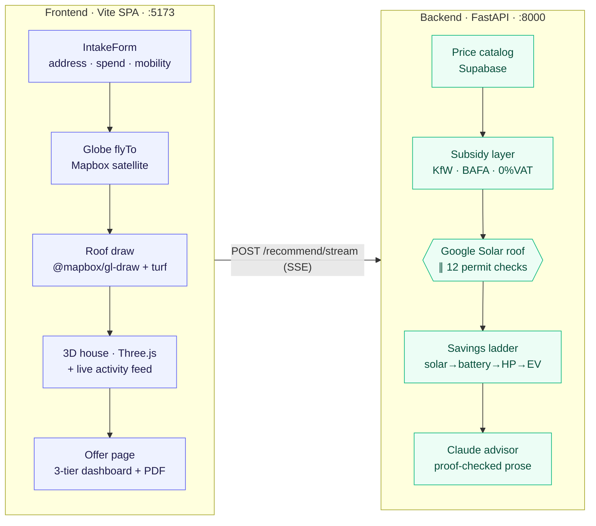

<div align="center">

# Heimwende Energy Advisor

**One number. How much your household saves per month after going all-electric.**

Solar · Battery · Heat Pump · EV Charger — bundled with financing and a dynamic tariff, sold as a single product.

<br/>


<br/>


</div>

---

## What it does

A homeowner types their address, draws their roof on a satellite map, and within seconds sees a live pipeline run — real Google Solar roof analysis, 12 live German permit checks, subsidy resolution, and a deterministic savings engine — that lands on a single honest number: **how much they save per month** after a fully-financed home energy upgrade.

The result is presented as three packaged offers (Solar Start / Solar + Heat / Full Bundle), each self-contained: capex after KfW/BAFA subsidies, monthly loan installment, projected energy spend by bucket, and a permanent saving once the loan is paid off. A personalised advisor letter explains the recommendation in prose. The whole offer exports as a formatted 3-page PDF.

**The LLM never computes the number.** Claude writes the letter. Every euro figure comes from deterministic backend domain code.

---

## The flow

```
Address + roof draw → live SSE pipeline → three-tier offer page → PDF download
```



The frontend opens a streaming POST and renders each backend step as it happens — roof analysis, permit checks, subsidy resolution — in a live activity feed next to the 3D house model. The user watches the platform work, not a spinner.

---

## Quick start

Two terminals, two apps:

```bash
# Backend — FastAPI on http://localhost:8000
cd apps/backend
cp .env.example .env          # works without keys; add them to unlock live data layers
uv sync
uv run uvicorn app.main:app --app-dir src --reload --port 8000

# Frontend — Vite on http://localhost:5173
cd apps/frontend
cp .env.example .env          # set VITE_MAPBOX_TOKEN (required for the map)
pnpm install
pnpm dev
```

The frontend automatically uses `?fixture=demo-detached` in dev mode — you get a fully working UI with realistic numbers even without a running backend or any API keys.

> **`VITE_MAPBOX_TOKEN` is required** for the globe, address autocomplete, and roof-draw map. Without it the map renders silently broken. The root Makefile references old paths (`apps/api`, `apps/web`) — use the commands above directly.

### Backend API keys

All keys are optional — a missing key degrades that layer to a labelled fallback; the run still completes.

| Variable | Unlocks |
|---|---|
| `ANTHROPIC_API_KEY` | Claude advisor letter + Bebauungsplan clause extraction |
| `GOOGLE_SOLAR_API_KEY` + `GOOGLE_GEOCODING_API_KEY` | Real roof geometry and site-specific PV yield |
| `SUPABASE_URL` + `SUPABASE_SERVICE_ROLE_KEY` | Price catalog, subsidy catalog, MaStR neighbour count, run persistence |
| `TAVILY_API_KEY` | Bebauungsplan web search + MaStR scrape fallback |

### Database migrations

```bash
psql "$DATABASE_URL" -f supabase/migrations/202606200001_f04_schema.sql
psql "$DATABASE_URL" -f supabase/migrations/202606210001_f26_subsidy_catalog.sql
psql "$DATABASE_URL" -f supabase/seed.sql
```

---

## Architecture

### The savings ladder

The engine runs four cumulative rungs against real site data (roof yield, local prices, resolved subsidies):

```
☀️ Solar  →  🔋 + Battery  →  ♨️ + Heat pump  →  🚗 + EV charger
```

Each rung is a full `ScenarioResult`. Per-layer deltas sum exactly to the headline. The three dashboard tiers (`low / middle / high`) are pure copies of ladder rungs — no new math, no LLM figures.

North star metric: `monthly_saving = current_spend − (loan_installment + new_energy_cost)`. On the demo household: **≈ €137/mo** for the full bundle.

### What the pipeline actually does

| Step | What it calls |
|---|---|
| Price catalog | Supabase `price_catalog` — PV €/kWp, battery €/kWh, tariffs, grid fees per PLZ |
| Subsidy layer | Supabase `subsidy_catalog` — KfW 458 (30 %+20 %), BAFA, 0 % VAT; gated by validity date |
| Geocoding | Google Geocoding → Berlin-centre fallback |
| Roof analysis | Google Solar `buildingInsights` → usable area, dominant orientation, site-specific kWh/kWp |
| 12 permit checks | OpenPLZ, Denkmal WMS, OSM Overpass, Tavily + Claude, MaStR, hardcoded GEG/LBO rules (parallel workers) |
| Savings engine | Pure Python domain code — no imports from adapters or LLM |
| Advisor letter | Claude (provider-agnostic adapter) — prose only; `assert_numbers_grounded()` rejects any invented figure |
| Persistence | Supabase `runs` / `proposals` — best-effort, never blocks the response |

### The 12 permit checks

Each check makes live HTTP calls and returns a structured result (pass / warn / fail / info) with a cited clause and source URL:

| Check | Source |
|---|---|
| PLZ → Bundesland | OpenPLZ API |
| Solar — Denkmalschutz | Denkmal WMS (Bayern, NRW, Berlin, RLP…) → OSM Overpass fallback |
| Heat pump — Denkmalschutz | Same sources |
| Solar + HP — Bebauungsplan | Tavily search → Claude Haiku extracts permit clauses |
| Solar — neighbour precedent | Supabase `plz_solar_count` → MaStR scrape → Tavily |
| EV — private parking | OSM Overpass + intake checkbox |
| EV — WEG / apartment | OSM Overpass building type → §20 WEG / §554 BGB |
| HP — GEG 2024 boiler age | Hardcoded rule (GEG §71/§72) |
| HP — TA Lärm noise | OSM Overpass plot density |
| Solar — LBO verfahrensfrei | Hardcoded LBO baseline |
| Battery — install + MaStR | Hardcoded advisories |

Every check degrades to a `warn` (not a crash) when its source is unavailable.

### Key architecture invariants

- **The LLM never computes money.** `assert_numbers_grounded()` scans every prose figure against the computed payload; invented numbers → fallback to deterministic stub copy.
- **No secrets in the frontend.** Only `VITE_API_BASE_URL` and `VITE_MAPBOX_TOKEN` (a publishable Mapbox token) touch the browser.
- **Domain purity.** `apps/backend/src/app/domain/` never imports from `adapters/`, `api/`, or `services/`. Pricing and subsidies are injected as typed context.
- **Every external call degrades gracefully.** A failed source emits a labelled `fallback_used` event and the run continues.

---

## Frontend

The intake is a 5-step state machine in [`IntakeScreen.tsx`](apps/frontend/src/features/intake/IntakeScreen.tsx) over one shared Mapbox map and a Three.js stage:

```
intake (form) → zooming (globe flyTo) → roof-draw (polygon) → roof-params (type + pitch) → viewing (3D + live feed)
```

[`roofGeometry.ts`](apps/frontend/src/features/viewer/roofGeometry.ts) converts the drawn polygon to local metre space, builds gable/hip/flat/shed roof geometry, and places the four upgrade modules (PV · battery · heat pump · EV charger) anchored to the footprint. Camera framing scales off the footprint extents so every house frames cleanly.

The live activity feed streams `PipelineEvent` objects from the SSE response via a pure reducer ([`pipeline.ts`](apps/frontend/src/features/activity/pipeline.ts)), updating a `PipelineRunState` that drives both the feed text and the 3D house module visibility.

The offer page (`OfferResultPage`) renders the three tiers from `Recommendation.tiers` and provides a **PDF download** — three A4 pages (packages, evidence + full assumptions table, advisor letter) generated client-side via `@react-pdf/renderer`, lazy-loaded on demand.

---

## The contract seam

`specs/` is the source of truth and wins over prose when they disagree:

- [`specs/api/openapi.yaml`](specs/api/openapi.yaml) — the HTTP contract (F02, frozen). Frontend TS types and backend Pydantic models are both derived from it. A change updates all three in the same commit.
- [`specs/domain/savings-engine.spec.md`](specs/domain/savings-engine.spec.md) — every formula + a worked example as machine-checkable test vectors. The engine is TDD'd against these.

Append `?fixture=demo-detached` (or `?fixture=nahholz-buchen`) to any `POST /recommend` call to get a golden payload with no engine, LLM, or DB call.

---

## Repository layout

```
apps/
  backend/                          FastAPI BFF + pure domain core
    src/app/domain/savings/         the ladder engine
      electricity_layer.py          PV + battery bucket math
      heatpump_layer.py             heat pump bucket math
      ev_layer.py                   EV charger bucket math
      solar_layer/                  Google Solar roof analysis (INFO.md)
      permit_layer/                 12 live German permit checks (INFO.md)
      subsidy_layer/                KfW/BAFA/VAT subsidy catalog
      tiers.py                      three dashboard offer packages
    src/app/adapters/               resolver · supabase · llm · irradiance
    src/app/services/               recommendation.py · run_stream.py (SSE)
    src/app/api/routes/             advisor · permits · subsidies · health
  frontend/                         Vite + React + TS + Tailwind SPA
    src/features/intake/            IntakeForm + IntakeScreen (state machine)
    src/features/roof/              RoofDrawStep + RoofParamsStep
    src/features/viewer/            HouseCanvas + roofGeometry (3D)
    src/features/activity/          live activity feed + pipeline reducer
    src/features/offer/             OfferResultPage + EnergyPlanPdf (PDF)
    src/lib/                        api.ts · types.ts (F02) · mapbox-geocode.ts
specs/                              frozen contracts: openapi.yaml + savings-engine.spec.md
supabase/                           Postgres migrations + seed
docs/feature_track/                 feature backlog + build timeline
```

Each savings sub-engine has an `INFO.md` next to the code. The per-app `CLAUDE.md` files hold the working rules for contributors: [backend](apps/backend/CLAUDE.md) · [frontend](apps/frontend/CLAUDE.md).

---

<div align="center">

Built at the **Berlin Energy AI Hackathon — June 2026** for the [Cloover](https://cloover.com) track.

</div>
